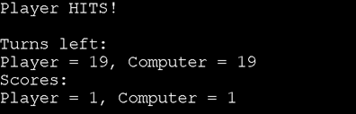

# Sea-Dominion

- Sea Dominion is a python-based battleships game which allows the player to battle against the computer in a classical battleships style. The player and the computer are both provided with a board on which the ships are randomly placed. The player will get 20 attempts to sink the computer's ships by guessing the position of the ships. The game is based both on luck and strategy, as the player has to guess the position of the computer's ships at first, while later being able to strategically pin down their position.

- The live link is found via this link - [Sea-Dominion](https://sea-dominion-cb02afeb3150.herokuapp.com/)

## How to Play
### Gameplay
- When first opening the game the player will be presented with a menu, which explains the rules. The player will also be asked to enter a username, which has to be at least 4 characters long.
After entering the username, the player will be greeted with the applied username and a line will declare: Begin sea battle!
- On the Gameboard, the player can see the ships, marked as "€". The purpose f the game is to find and sink all the computer's ships before the computer does the same with the player's ships. Having 20 attempts, the player must guess the position of the computer's ships by entering numbers representing horizontal and verical rows on the Gameboard.
When the player guesses a row on the board, the game will either say "{player}" HITS!" or "{player} MISSES!", depending on the outcome of the guess. A hit will display an "X", while a miss will display an "O". The player will then be informed how many attempts are left.
### Game over
- If the player manages to sink all the computer's ships the game will declare: "You won! All the computers ships have been sunk." If it's the other way around and the computer sinks the player's ships, the game will instead declare "You lost! All Your ships have been sunk." The player will then have the option to either quit the game or start a new game.
- Sometimes the game will result in a draw when all 20 attempts have been used. The game will then declare "Both players have ships remaining." The player will then have the option to either quit the game or start a new game.

## Site Owner Goals
- To provide an easy-to-play, accessible game with rules that are easy to comprehend.
- That the player feels inspired to play the game by strategically guess the coordinates of the computer's ships.
- The player should feel that the game is challenging enough, but not too hard to play.
- The player should also feel that the game is an interactive experience.
- As a returning player, one should feel that one can upskill while learning the strategies of the game.

## User Stories
### First time user
- As a first time user, the player should be comfortable with the rules and terms of the game and should easily be able to start playing immediately.
- A first time user will also feel the interactivity of the game and access the game board easily.
- To a first time user, the game should be challenging without being confusing.

### Returning user
- A returning user should have no problem getting back into the rules of the game.
- A returning user can use and develop the strategies to more easily locate and sink the computer's ships.
- A returnign user should also be comfortable with playing multiple times to try to beat the computer.

### Frequent user
- The frequent user will develop the skills to beat the computer in a battleships game.
- The frequent user can enjoy the accessibility of the game's layout.
- As a frequent user You should also enjoy the challenge of the game's randomness. No round of the game will be exactly the same.

## Flow charts

- This was the first flowchart which later was replaced with the current one below.

## Design
- This game is based purely on python code and therefor it is totally text-driven. There are no graphic elements in the game - it runs in a terminal only.

## Features
- When entering the site, the player will be greeted with a very basic text-based menu which explains the rules of the game. The player will be askesd to enter a username. The validation of the user input is strong - if the player enters anything but a four letter username, the game will throw an error message.
- After entering the username, the player will be presented with the game boards, with the player's board at the top and the computer's board at the bottom of the screen. The player's three ships will be visible as "€" on the board, while the computer's ships are hidden.
- The player will also be asked to guess the coordinates of the computer's ships. The player guesses these coordinates by typing numbers for each row and column on the board, e.g. "Enter row (0-4) : 2, Enter column(0-4) : 1". Also here, the validation of the user input is strong - if the player enters a word, a letter or a blank space instead of a number, the game will alert the player with "Interesting, but You should enter a number".
- The scores are updated instantly after each turn:

## Testing

### PEP8 Testing
The code has been tested with the pep8 validation tool, which currently returns no errors.
### Input Testing
- The input validation has been tested to check that the rules for the correct input works properly.
- When the player is asked to type the username the screen should read:

- When done correctly, the screen will display this:

- When done incorrectly, the game will throw this error message:

- If the player enters anything but a number in the rows/columns- section under the board, the game adequately alerts the player with this message:

- When the player guesses a row and column right, the game correctly declares that it is a hit
The scores and turns that are left are also updated instantly:

-If the player guesses a row and column wrong, the game adequately declares that it is a miss
The scores and turns that are left are also updated instantly:

- When the game is over, the player will be asked "Play another game?". If the player types anything other than "yes" or "no", the game will throw this message correctly:

### Other Game Testing
- [Responsinator](http://www.responsinator.com/?url=https%3A%2F%2Fsea-dominion-cb02afeb3150.herokuapp.com%2F)
- [Am I responsive](https://ui.dev/amiresponsive?url=https://sea-dominion-cb02afeb3150.herokuapp.com/)
## Technologies Used
- Python3
### Libraries used
- [Random](https://docs.python.org/3/library/random.html?highlight=random#module-random)
### Platforms used
- [Heroku](https://www.heroku.com/)

## Data model
- This game uses a class named Gameboard. This class represents the overall logic flow of the game and represents the entire board.

### Programs Used
- Github
- Gitpod
- Heroku
- PEP8
- VS Code

## Known Bugs
- The game says "You lost! All Your ships have been sunk", after only three attempts.

## Fixed Bugs

## Deployment
-

## Credits
-  This project was a great help for me to understand how the code logic works and how to operate the functions inside it.
-  This video tutorial n how to build a battleships game very interesting and provided a lot of info on the subject. Even though it is 'intermediate', and maybe too advanced for me at the moment, it certainly gave inspiration for future projects.
-  A great basic project for python based games which was very helpful for my project as well.

### Resources Used
#### Online Resources
- Youtube (Used to find tutorials and inpiration on the subject)
- W3CSchools (Used to find tips and information about python code)
- Stack Overflow (Used to find tips and information about python code)
- Pep8 (Used to check the code for syntax errors, indentation errors and warnings)
- TinyPNG (Used to compress images for this README file)
- Lucidchart (Used to create the flowchart image)
- Diffchecker (Used to compare old code with updated code)

#### Desktop resources
- VS Code (Used to write code locally and make a local safe copy of the code on the computer)

## Acknowledgments
- All the kind people in the Slack community which have provided alot of help during the development of this project.
- My mentor Antonio for his useful tips and recommendations.
