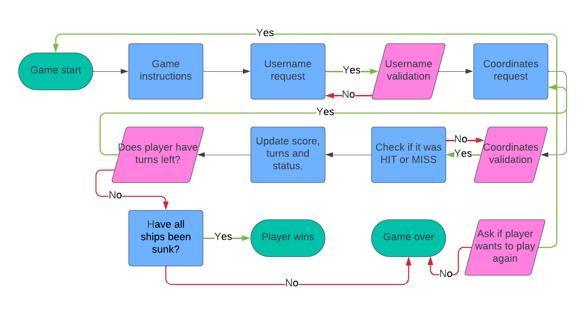

# Sea-Dominion

- Sea Dominion is a python-based battleships game which allows the player to battle against the computer in a classical battleships style. The player and the computer are both provided with a board on which the ships are randomly placed. The player will get 20 attempts to sink the computer's ships by guessing the position of the ships. The game is based both on luck and strategy, as the player has to guess the position of the computer's ships at first, while later being able to strategically pin down their position.

- The live link is found via this link - [Sea-Dominion]()

## How to Play
### Gameplay
- When first opening the game the player will be presented with a menu, which explains the rules. The player will also be asked to enter a username, which has to be at least 4 characters long.
After entering the username, the player will be greeted with the applied username and a line will declare: Begin sea battle!
- On the Gameboard, the player can see the ships, marked as "€". The purpose f the game is to find and sink all the computer's ships before the computer does the same with the player's ships. Having 20 attempts, the player must guess the position of the computer's ships by entering numbers representing horizontal and verical rows on the Gameboard.
When the player guesses a row on the board, the game will either say "HIT!" or "MISS!", depending on the outcome of the guess. A hit will display an "X", while a miss will display an "O". The player will then be informed how many attempts are left.
### Game over
- If the player manages to sink all the computer's ships the game will declare: "You won! All the computers ships have been sunk." If it's the other way around and the computer sinks the player's ships, the game will instead declare "You lost! All Your ships have been sunk." The player will then have the option to either quit the game or start a new game.
- Sometimes the game will result in a draw when all 20 attempts have been used. The game will then declare "Both players have ships remaining." The player will then have the option to either quit the game or start a new game.

## Site Owner Goals
-

## User Stories

## Flow charts

- This was the first flowchart which later was replaced with the current one below.

## Features

## Testing

### PEP8 Testing
The code has been tested with the pep8 validation tool, which currently returns no errors.
### Input Testing

### Other Game Testing

## Technologies Used
- Python3

### Programs Used
- Github
- Gitpod
- Heroku
- PEP8
- VS Code

## Known Bugs
- The game says "You lost! All Your ships have been sunk", after only three attempts.
- Sometimes when the playre types a number, the game will throw an error 'Interesting, but You should enter a number.'

## Fixed Bugs

## Deployment

## Credits
https://github.com/SaraabbasiNZ/battleship-game-python/blob/main/run.py (This project was a great help for me to understand how the code logic works and how to operate the functions inside it.)
https://www.youtube.com/watch?v=MgJBgnsDcF0&t=1145s (This video tutorial n how to build a battleships game very interesting and provided a lot of info on the subject. Even though it is 'internediate', and maybe too advanced for me at the moment, it certainly gave inspiration for future projects.)

### Resources Used
#### Online Resources
- Youtube (Used to find tutorials and inpiration on the subject)
- W3CSchools (Used to find tips and information about python code)
- Stack Overflow (Used to find tips and information about python code)
- Pep8 (Used to check the code for syntax errors, indentation errors and warnings)
- TinyPNG (Used to compress images for this README file)
- Lucidchart (Used to create the flowchart image)

#### Desktop resources
VS Code (Used to write code locally and make a local safe copy of the code on the computer)

## Acknowledgments
- All the kind people in the Slack community which have provided alot of help during the development of this project.
- My mentor Antonio for his useful tips and recommendations.
